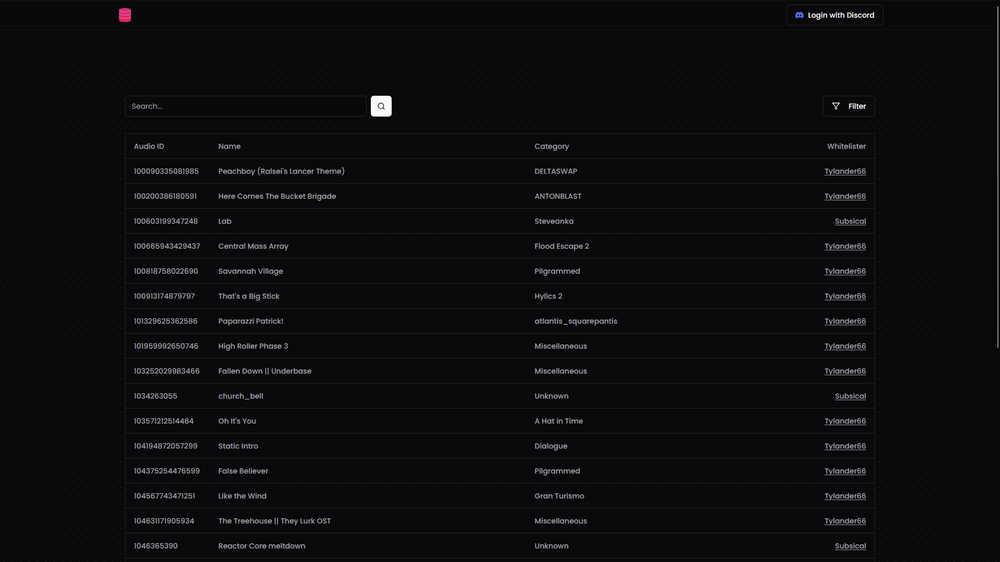

<h1 align="center">
    
        
    
    Blockate Audio Database
</h1>

    A SvelteKit web application to search through and manage whitelisted audio IDs on <a href="https://blockate.com">Blockate</a>

    

<h2>Features</h2>

<ul>
    <li>Search through audio IDs by audio name, category, or whitelister</li>
    <li>Add, edit or remove audio IDs from the database</li>
</ul>
